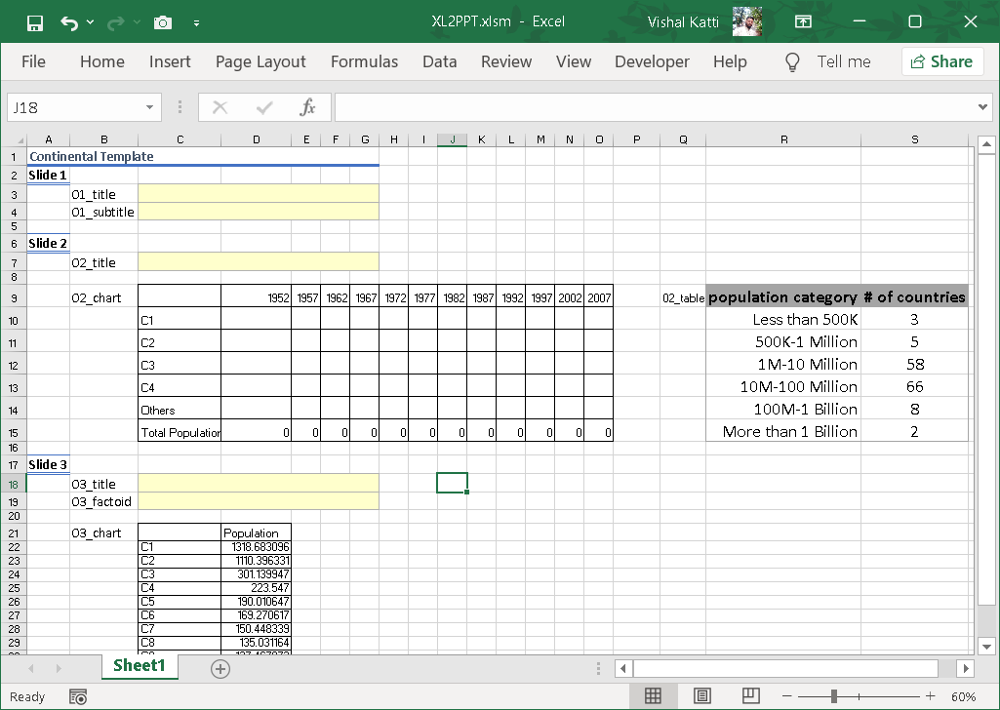

```{r setup, include=FALSE}
knitr::opts_chunk$set(echo = TRUE)
library(details)
```

One of the most common tasks in most offices, is creating presentations
and reports in Microsoft PowerPoint. While the tool is great for
creating ad hoc presentations, editing the same with new data on a
periodic basis gets tedious. Now, I know that some wonderful packages
like `officer` and `officedown` exist that enable us to create
PowerPoint presentations with editable charts from R itself. You can
read all about this in the amazing [Alison Hill's blog post "Up and
running with
officedown"](https://alison.rbind.io/blog/2021-07-officedown/).

Since I discovered R while looking for a better alternative to VBA for
data analysis and Excel/PowerPoint automation, the following is an
alternative workflow to create multiple PowerPoint presentations using a
combination of these technologies. Note that this workflow uses the
`RDCOMClient` package which works in Windows environment only.

## TL;DR

In this 2-part blog, we create a PowerPoint template with named
placeholders which we populate from an Excel file using VBA. The Excel
file is loaded with data using R with the help of `openxlsx` package and
then the macro is triggered using the `RDCOMClient` package.

This solution has great potential to give you the same feeling as those
Jurassic Park scientists that Dr. Ian Malcolm remarked about!

Advantages of this approach over `officer` and `officedown`:

1.  Slide/content/header/footer formatting control is in the PowerPoint
    template rather than R code.
2.  All charts are native and can contain any feature (dual axis, mixed
    data series like bar + line, line + points). All Excel chart-types
    are available. Go wild!
3.  You can use any PowerPoint template design (Yes, even your
    sad/weird/exciting corporate template!).

Let's begin.

Suppose we want to automate the following PowerPoint presentation. It
contains 3 slides with a title slide and 2 content slides having graphs
and tables created from the `gapminder` dataset. This `.pptx` file also
has a custom footer.


We want to create the same presentation with same structure but at a
continent-level. `gapminder` has data for 5 continents and we wish to
create 5 presentations by the end of this.

## The PowerPoint Template

In this approach, we start with the PowerPoint presentation file. We
will create a template with placeholders and charts with dummy data.
Usually, you would have a copy of the `.pptx` file you want to automate.
Save a copy of it as a `PowerPoint Template (.potx)`, ideally to your R
Project folder. To know more about what an R Project is, read about it
[here](https://support.rstudio.com/hc/en-us/articles/200526207-Using-Projects).
In my case, I've created a new R Project folder named `R2XL2PPT` as
shown below.

")

Now let us prep the template. If you open the template file by
double-click or right-click \> New, it would open a fresh `.pptx`
presentation using the template. Right-Click and click Open in the
context menu to open the `.potx` template file for editing.


Once you have the template open, we will add names to all the text
placeholders, tables and graphs we wish to update. To update the
placeholder name:

1.  Select the shape/text-area/table/graph.
2.  From Shape Format, click Selection Pane.
3.  In the Selection Pane, change the name of the selected item.


Advisory: We use the format `NN_[Position]Object` where `NN` is the
slide number, `[Position]` is the either TopLeft, TopRight, BottomLeft,
BottomRight or any other position and finally, `Object` is either Table,
Chart, Title, Subtitle, TextBox etc. You can use any fancy identifier
here, just make sure that your future self and others can recognise them
easily.

Once you set the names of all the items that you want to customise, save
the template.

Download the `GP_template.potx` template
[here](content/GP_template.potx).

## The Excel Template

To populate all the named items in the PowerPoint template, we will now
create an Excel document which looks identical to the template with
respect to the named items. Please see image below.


For every named item, depending on whether it is a textbox or chart or
table, we will create a named range for that item. For example, for item
`01_title` in the PowerPoint template, we create a `S1_title` named
range (which points to cell C3) as a placeholder for it. If you don't
know how to create a named range in Excel, read more
[here](https://support.microsoft.com/en-us/office/define-and-use-names-in-formulas-4d0f13ac-53b7-422e-afd2-abd7ff379c64).

> Excel does not allow named ranges names to start with a number, hence
> `01_title` is mapped to `S1_title`. The S stands for Slide. Just one
> of those Excel quirks I guess!

You can set a single Excel cell as named range for each **textbox** in
the PowerPoint template. You can copy-paste **tables** from Powerpoint
to the Excel template directly. The entire table must be set as a named
range.

For charts, right-click the chart in PowerPoint and select `Edit Data`.
An excel worksheet is displayed with the underlying data. Copy-paste the
entire data into the Excel template.

{width="225"}

For the `GP_template.potx`, the corresponding excel template
`XL2PPT.xlsm` looks like the below image. Please note that this template
does not have the VBA macro yet.



## The VBA Macro

We want the VBA macro to:

1.  Open a new instance of PowerPoint presentation using the
    `GP_template.potx` file.
2.  Copy text/numbers from various placeholders and replace existing
    text/numbers in the PowerPoint presentation.
3.  Save the presentation with custom file name with `.pptx` extension.

The actual mapping of the named ranges in the Excel template to the
named shapes in the PowerPoint template happens in the VBA code.
However, at this stage, you can actually create the PowerPoint
presentation by copying the numbers into the Excel template and hitting
the big `RUN MACRO` button.

For your reference, I am embedding the VBA macro code below. You can
download the `XL2PPT.xlsm` file from [here](content/XL2PPT.xlsm).

```{r VBA-Macro-Code, echo=FALSE}
details(
  '<script src="https://gist.github.com/vkatti/6b62c49c7dac8901b0194a758a77c0df.js"></script>',
  summary = "VBA Macro Code",
  lang = 'none'
)

```

## R

Suppose we want to create a 10 variations of PowerPoint presentation
using the same template. While creating the presentation from Excel is
now automated, how about creating the numbers for each of those 10
variations? This is where we bring in R with the `openxlsx` and
`RDCOMClient` packages. We use the `tidyverse` set of packages to read
in data, clean and massage the data into the various formats we need,
`openxlsx` to write the data (single numbers, text or tables of numbers)
to the Excel template and `RDCOMClient` to run the embedded VBA code in
the Excel template.

Check out the upcoming Part 2 of this blog to see how to run VBA code
using R. Let me know if you find this useful or any corrections required
in the comments below.
