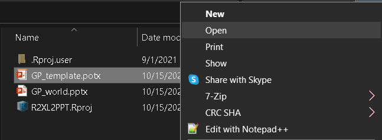

```{r setup, include=FALSE}
knitr::opts_chunk$set(echo = FALSE)
```

One of the most common tasks in most offices, is creating presentations
and reports in Microsoft PowerPoint. While the tool is great for
creating adhoc presentations, editing the same with new data on a
periodic basis gets tedious. Now, I know that some wonderful packages
like `officer` and `officedown` exist that enable us to create
PowerPoint presentations with editable charts from R itself. You can
read all about this in [Alison Hill's blog post "Up and running with
officedown"](https://alison.rbind.io/blog/2021-07-officedown/).

Since I discovered R while looking for a better alternative to
Excel/PowerPoint automation using VBA, the following is an alternative
workflow to create multiple PowerPoint presentations using a combination
of these technologies. Note that I am working on a Windows machine and
certain steps shown below may be different for other operating systems.

## TL;DR

We create a PowerPoint template with named placeholders which we
populate from an Excel file using VBA. The Excel file is loaded with
data using R with the help of `openxlsx` package and then the macro is
triggered using the `RDCOMClient` package.

This solution has great potential to give you the same feeling as those
Jurassic Park scientists that Dr. Ian Malcolm remarked about!

Advantages of this approach over `officer` and `officedown`:

1.  Slide/content/header/footer formatting control is in the powerpoint
    template rather than R code.
2.  All charts are native and can contain any feature (dual axis, mixed
    data series like bar + line, line + points). All Excel chart types
    are available.
3.  You can use any PowerPoint template design (Yes, even your
    sad/weird/exciting corporate template!).

Let's begin.

## The PowerPoint Template

In this approach, we start with the PowerPoint presentation file. We
will create a template with placeholders and charts with dummy data.
Usually, you would have a copy of the `.pptx` file you want to automate.
Save a copy of it as a `PowerPoint Template (.potx)`, ideally to your R
Project folder. To know more about what an R Project is, read about it
[here](https://support.rstudio.com/hc/en-us/articles/200526207-Using-Projects).
In my case, I've created a new R Project folder named `R2XL2PPT` as
shown below.

")

Now let us prep the template. If you open the template file by
double-click or right-click \> New, it would open a fresh presentation
(.pptx) using the template. Right-Click and click Open in the context
menu to open the template file (.potx) for editing.




Once you have the template open, we will add names to all the text
placeholders, tables and graphs we wish to update. To update the
placeholder name:

1.  Select the shape/text-area/table/graph.
2.  From Shape Format, click Selection Pane.
3.  In the Selection Pane, change the name of the selected item.


Advisory: We use the format `NN_[Position]Object` where `NN` is the
slide number, `[Position]` is the either TopLeft, TopRight, BottomLeft,
BottomRight or any other position and finally, `Object` is either Table,
Chart, Textbox etc. You can use any fancy identifier here, just make
sure you, your future self, and others can recognise them.
