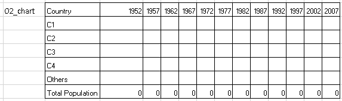

```{r setup, include=FALSE}
knitr::opts_chunk$set(echo = TRUE)
```

This is part 2 of 2. Read part 1
[here](https://www.vishalkatti.com/posts/2021-08-29-rtovbatoppt/ "link to Part 1 of this article.").

## Quick Recap

In the previous post, we create the `.potx` template from the `.pptx`
file we wanted to automate and the Excel template with the macro `.xlsm`
that uses the PowerPoint template to create a new `.pptx` file with
given data using VBA.

The report we want to automate is...


...and the Excel and PowerPoint template we created are shown below.


In this post, we will write the R script that will first massage the
data into desired format and then load the data for one region into the
Excel template and execute the VBA macro that will create the PowerPoint
file with that data.

## Strategy

Before we dive into code, we need to check a few things. We wish to
create a presentation for each continent in the Gapminder data. A closer
look at the Presentation will tell you what kind of data we need for
each slide/graph/table while the Excel template will reveal what should
the structure of each dataset should be. While looking into this
structure, some questions will pop-up. The idea here is to create the
datasets in such a way that they can be easily filtered for each
continent and the resultant table can be written to the Excel template
without any or very little modification. Let us proceed slide-by-slide.

## Creating the datasets

### Slide 1

Slide 1 is the title page and needs 2 strings; one for Title, one for
Subtitle. The Title for the base presentation is "World Population". For
each continent, it could be "\<continent_name\> Population". The
subtitle is a combination of Author Name and Created Date. So we need a
string like "\<author_name\> \| \<created_date\>" where created_date is
the formatted system date.

These strings can be created while writing the data to the Excel
template.

### Slide 2

The chart on slide 2 needs raw data structured as below. You will notice
that at a continent-level, this table needs a minimum of 5 countries. Do
we have any continents in the Gapminder data with less than 5 countries?
Yes, we have Oceania with only Australia and New Zealand. For ease of
use, let us include these countries along with Asian countries in a new
`Region` variable.



We will create the `region` variable in the gapminder data. But first,
let us load some relevant packages.

```{r load-packages}
options(tidyverse.quiet = TRUE)
library(tidyverse) # duh!
library(reactable) # to display the tables interactively in this post. Not really needed for the final solution.
library(openxlsx) # to write the data to the Excel Template.
library(RDCOMClient) # to load and run the Excel macro post data load.
```

```{r read-data}

# Read in Gapminder data
gp <- gapminder::gapminder

# Create new region variable
gp <- gp %>%
  mutate(region = if_else(as.character(continent) %in% c("Asia","Oceania"),
                          "Asia-Pacific", 
                          as.character(continent)),
         country = as.character(country))

# Keep only relevant columns
gp <- gp %>% select(region, country, year, pop)

# View details
glimpse(gp)
```

Now that we have the source data available, we must now create the
datasets we need that we can write to the Excel template for each
region.

The required table shows the top 4 countries (based on 2007 population)
and all other countries clubbed into 'others' in a given region and then
the total population of the region on a yearly basis. This table has to
be created for all 4 regions.

```{r 02_chart, layout="l-body-outset"}
pop_trend <- gp %>%
  group_by(region, country, year) %>% 
  summarise(pop = sum(pop, na.rm = TRUE),
            .groups = 'drop') %>%
  pivot_wider(names_from = year, values_from = pop, names_sort = TRUE) %>% 
  arrange(desc(`2007`)) # sort by max pop to min pop in latest year i.e. 2007

reactable(pop_trend, compact=TRUE,
                     style = "font-size:12px")
```

Now that we have the required columns, let's plan the row order. We
notice that, for each region, we have the top 4 countries (as per 2007)
, followed by 'Others'. Let's create the `top-4` dataset.

```{r top-4, layout="l-body-outset"}
top4 <- pop_trend %>% 
  group_by(region) %>% 
  slice_max(`2007`, n = 4, with_ties = FALSE) %>% 
  ungroup()

reactable(top4, compact=TRUE, style = "font-size:12px")
```

To create the `others` dataset, we exclude all countries that are
present in the `top-4`.

```{r others, layout="l-body-outset"}
others <- pop_trend %>% 
  filter(!country %in% top4$country) %>% 
  group_by(region) %>% 
  summarise(across(.cols = -country, .fns = sum),
            .groups = 'drop') %>% 
  mutate(country = "Others") %>% 
  select(region, country, everything())

reactable(others, compact=TRUE, style = "font-size:12px")
```

While we create the `top-4` and `others` datasets separately, we will
combine them later at the very last moment before writing them to the
Excel template.

Now that we have the datasets needed for `02_chart`, let's proceed to
the create `02_table` . This table gives you the count of countries that
fall under various population ranges.

{width="250"}

Let's create `02_table`. To create this table, we first create a new
variable called `pop_range`.

```{r 02_table}

pop_levels <- c('Less than 500K','500K - 1 Million',
                '1M - 10 Million', '10M - 100 Million',
                '100M - 1 Billion', 'More than 1 Billion')

gp2007 <- gp %>% 
  filter(year == 2007) %>% 
  mutate(pop_range = case_when(pop < 5E5 ~ pop_levels[1],
                               pop < 1E6 ~ pop_levels[2],
                               pop < 1E7 ~ pop_levels[3],
                               pop < 1E8 ~ pop_levels[4],
                               pop < 1E9 ~ pop_levels[5],
                               TRUE      ~ pop_levels[6]),
         pop_range = factor(pop_range, levels = pop_levels))

pop_groups <- gp2007 %>% 
  group_by(region, pop_range, .drop = FALSE) %>% 
  summarise(`# of Countries` = n(),
            .groups = 'drop') %>% 
  arrange(region, pop_range) %>% 
  rename(`Population Category` = pop_range)

reactable(pop_groups, compact=TRUE, style = "font-size:12px")
```

### Slide 3

Slide 3 contains 2 strings and one chart. The data for the chart looks
as shown below.


The data for `03_chart` is the list of top 10 countries in each region
as per latest record i.e. 2007. Let's create the `top10` table.

```{r top10, layout="l-body-outset"}
top10 <- gp %>% 
  filter(year == 2007) %>% 
  group_by(region) %>% 
  slice_max(pop, n = 10, with_ties = FALSE) %>% 
  ungroup() %>% 
  select(-year) %>% 
  mutate(pop = round(pop/1E6, 4)) %>% # population in millions
  set_names(c("Region","Country","Population"))

reactable(top10, compact=TRUE, style = "font-size:12px")
```

\#\# Loading the template
