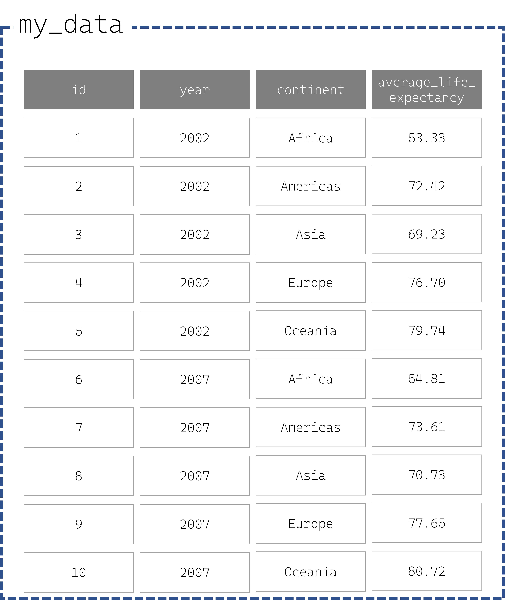
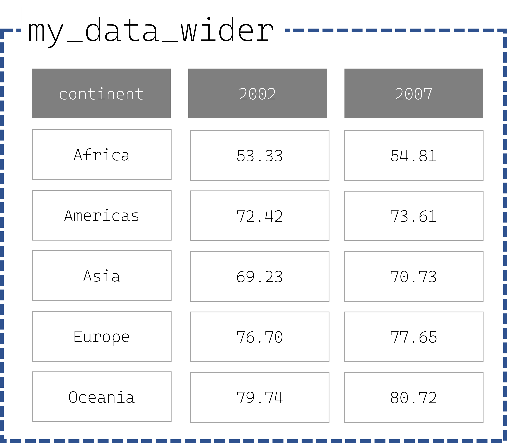

```{r setup, include=FALSE}
knitr::opts_chunk$set(echo = TRUE)
```

# Intro

This is part 2 of the Pivoting your tables with Tidyr series. Read Part 1 [here](https://www.vishalkatti.com/posts/2022-07-08-tidyrpivotlonger/).

We discussed the advantages of using the long format during data analysis, most users feel that the wide format is more readable by human. This is why most reports tend to have the data arranged in the wide format.

The wide format has at least one column which acts as a primary key i.e. it is unique and each value appears only once. It can also have multiple column whose unique combination acts as a primary key i.e. each combination appears only once.

Read more about wide vs. long formats [here](https://www.statology.org/long-vs-wide-data/).

While the long format is preferred and is desirable for data and plotting operations using R, Python or other data processing programming languages, the wide format is more human-readable. The {tidyr} R package has functions that allow you to transform your tabular data between the two formats.

In this post, we will see how to convert a long dataframe to wide format using the *pivot_wider()* function from {tidyr} package.

# The long one

Consider the following data table. It has been created from the famous Gapminder dataset. This table shows the average life expectancy in each continent for 2 years. While some of you may say that Gapminder data contains records for a lot more number of years, here we consider just the latest 2 years for ease of explanation and visual purposes. We have added an extra `id` column for teaching purpose.

{width="60%"}

`my_data` is in the long format as we have continent names and year in their own column and average life expectancy values for each unique combination of year and continent.  If we want to compare life expectancy across years for each continent, we need to have the life expectancy values for each continent side-by-side for easier viewing i.e. we need to convert to the wide format. To convert this tibble to the wide format, we need to push the `year` values into the headers and the `average_life_expectancy` values under the corresponding year column.

# The wide one

The wide format of this table would ideally have only `continent` and columns having each unique value in the `year` column as a header. In this case, the wide one would  look something like the table below.

{width="60%"}

The wide format has unique values of the column that are not pushed into headers. In this case, the `continent` column becomes unique for each row.

Let's recreate the above transformation in R. First, we create the `my_data` table.

```{r}
my_data <- data.frame(
  id = 1:10,
  year = c(2002L, 2002L, 2002L, 2002L, 2002L, 2007L, 2007L, 2007L, 2007L, 2007L),
  continent = c("Africa", "Americas", "Asia", "Europe", "Oceania", "Africa", 
                "Americas", "Asia", "Europe", "Oceania"),
  average_life_expectancy = c(53.33, 72.42, 69.23, 76.7, 79.74, 54.81, 73.61, 70.73, 77.65, 80.72)
)

knitr::kable(my_data)
```

To convert this table into wide format, we use the *pivot_wider()* function from {tidyr} R package. Let us see how to use this function.

💡*Tip: use `formals` to view all the formal arguments of a function and their default values. `formals` returns a named list.*

```{r}
library(tidyr, quietly = TRUE, warn.conflicts = FALSE)

formals(pivot_wider)
```

The result of `formals(pivot_wider)` tells us that the minimum information needed to use this function is to provide values to the `data`,`names_from` and `values_from` arguments as all other arguments have default values and hence, are optional.

Using only the minimum arguments with `pivot_wider()`, we get a wide formatted tibble but with missing data!

```{r}
wide_minimal <- pivot_wider(
                        data        = my_data,
                        names_from  = year,
                        values_from = average_life_expectancy
                        )

knitr::kable(wide_minimal)
```

**So why did `NA`s appear in the result?** 

`pivot_wider()` creates unique combinations of all columns not included in `names_from` or `values_from` argument. Therefore, if your dataframe/tibble had a primary key prior to the transformation, the primary key of your transformed "wide" dataframe is your old primary key + unique combinations of all columns not included in `names_from` or `values_from` argument. We do have `id` column as a primary key in the original tibble. This gives an unusable output with `NA`s for each combination. 

To specify which column/s to be made unique, pass their name to the `id_cols` argument. Here we pass the `continent` column to the `id_cols` argument.

```{r}
my_data_longer <- pivot_wider(
                        data        = my_data,
                        id_cols     = continent, 
                        names_from  = year,
                        values_from = average_life_expectancy
                        )

knitr::kable(my_data_longer)
```


If you are a visual person like me and wish to see this transformation with explanations, check out this GIF I made using good ol' PowerPoint.


# Conclusion

`pivot_wider()` is the successor for the great `spread()` function and has many advantages over the latter.  This function has many other arguments that allow some truly great transformations. Mastering this function (and its long counterpart) is a great skill upgrade while massaging your data to make it "tidy".

Happy Spreading!

# References

-   [Long vs. Wide Data: What's the Difference?](https://www.statology.org/long-vs-wide-data/)
-   Hadley Wickham and Maximilian Girlich (2022). tidyr: Tidy Messy Data. R package version 1.2.0. <https://CRAN.R-project.org/package=tidyr>
-   Yihui Xie (2022). knitr: A General-Purpose Package for Dynamic Report Generation in R. R package version 1.39.
